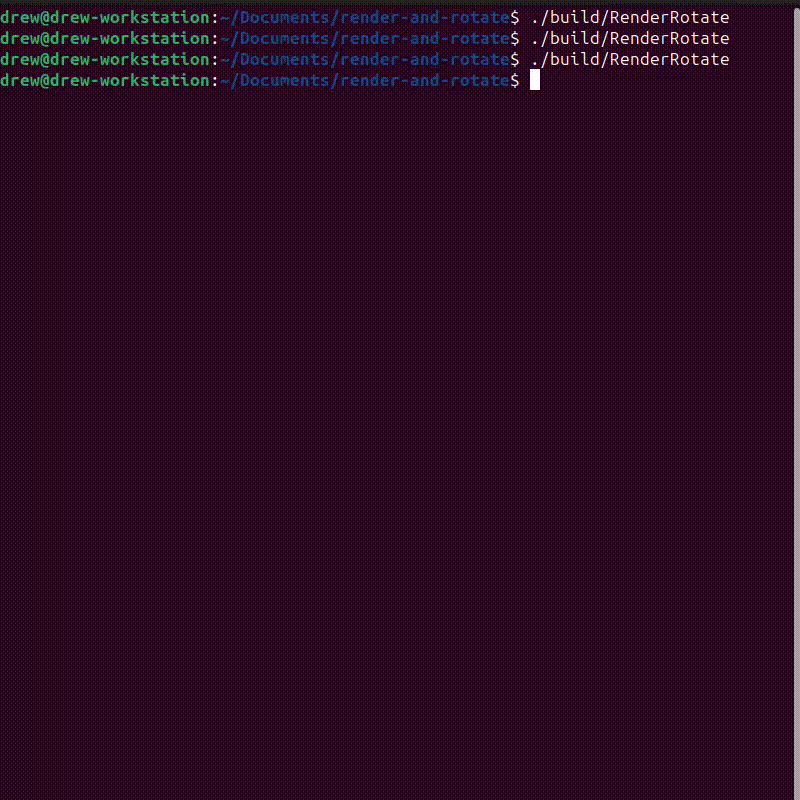

# Problem
## Formulation
This project presents a 3D simulation using SDL2 where cubes rotate with two rings inside. The core logic for rotating the objects and rendering the scene has been implemented from scratch.

## Dependencies
- SDL2


# Demonstration



# Installation
Clone the repo:
```
git clone https://github.com/AndrewChmutov/render-and-rotate
```

Enter the directory:
```
cd render-and-rotate
```

Create new directory and cmake it:
```
mkdir build
cmake -S . -B build
```

Build the program:
```
cmake --build build
```


# Usage
Run the program:
```
./build/RenderRotate
```